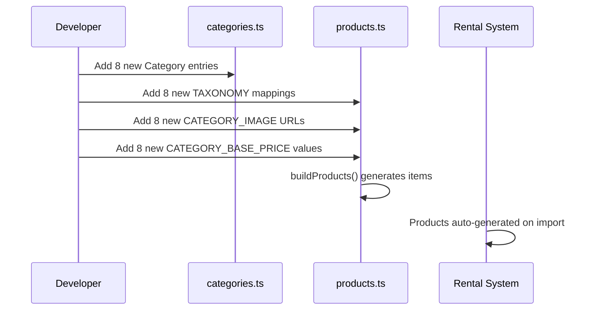

# Design Document: Expanded Category Catalog

## Overview

This feature expands the rental marketplace catalog from 20 construction/industrial-focused categories to 28 comprehensive categories covering home appliances, office furniture, medical equipment, industrial machinery, construction equipment, music instruments, photography gear, and defence/PSU-grade equipment. The expansion maintains the existing data generation architecture while adding 8 new category domains with 150+ new product types.

## Main Algorithm/Workflow



## Core Interfaces/Types

The existing type definitions remain unchanged. No modifications to `src/types/index.ts` are required.

```typescript
// Existing types remain unchanged
interface Category {
  id: string;
  name: string;
  icon: string; // Ionicons name
  color: string;
}

interface Product {
  id: string;
  vendorId: string;
  title: string;
  description: string;
  price: number; // per day
  images: string[];
  category: string; // category id
  availability: boolean;
  location: string;
  rating: number;
  reviewsCount: number;
  featured: boolean;
  popular: boolean;
  createdAt: string;
}
```

## Key Functions with Formal Specifications

### Function 1: CATEGORIES Array Extension

**File**: `src/data/categories.ts`

```typescript
export const CATEGORIES: Category[] = [
  // ... existing 20 categories remain unchanged ...
  
  // NEW: Home Appliances
  { id: "home-appliances", name: "Home Appliances", icon: "home", color: "#10B981" },
  
  // NEW: Office Appliances & Furniture
  { id: "office-equipment", name: "Office Equipment & Furniture", icon: "briefcase", color: "#3B82F6" },
  
  // NEW: Medical Equipment
  { id: "medical-equipment", name: "Hospital & Medical Equipment", icon: "medical", color: "#EF4444" },
  
  // NEW: Industrial Equipment (enhanced)
  { id: "industrial-heavy", name: "Industrial Heavy Equipment", icon: "settings", color: "#6366F1" },
  
  // NEW: Construction Equipment (enhanced)
  { id: "construction-heavy", name: "Heavy Construction Equipment", icon: "construct-outline", color: "#F59E0B" },
  
  // NEW: Music Instruments
  { id: "music-instruments", name: "Music Instruments & Audio", icon: "musical-notes", color: "#8B5CF6" },
  
  // NEW: Photography & Videography
  { id: "photography", name: "Photography & Videography", icon: "camera", color: "#EC4899" },
  
  // NEW: Defence/DRDO/PSU Premium
  { id: "defence-psu", name: "Defence / DRDO / PSU Premium", icon: "shield", color: "#14532D" },
];
```

**Preconditions:**
- Existing CATEGORIES array contains 20 categories
- All icon names are valid Ionicons identifiers
- All color values are valid hex color codes

**Postconditions:**
- CATEGORIES array contains 28 total categories (20 existing + 8 new)
- All new categories have unique IDs
- All entries conform to Category interface
- No existing categories are modified or removed

**Loop Invariants:** N/A (static array definition)

---

### Function 2: TAXONOMY Object Extension

**File**: `src/data/products.ts`

```typescript
const TAXONOMY: Record<string, string[]> = {
  // ... existing 20 categories remain unchanged ...
  
  // NEW: Home Appliances
  "home-appliances": [
    "Mixer Grinder",
    "Wet Grinder",
    "Microwave Oven",
    "Refrigerator",
    "Air Cooler",
    "Air Conditioner",
    "Washing Machine",
    "Vacuum Cleaner",
    "Steam Iron",
    "Water Purifier",
    "UPS/Inverter",
    "Generator",
    "Sofa Set",
    "Dining Table",
    "Drilling Machine",
  ],
  
  // NEW: Office Equipment & Furniture
  "office-equipment": [
    "Office Table",
    "Executive Desk",
    "Meeting Table",
    "Conference Chair",
    "Coffee Machine",
    "Printer",
    "Xerox Machine",
    "Scanner",
    "Projector",
    "LED TV",
    "Interactive Display",
    "Speaker System",
    "Lighting Equipment",
    "Laptop",
    "Desktop Computer",
    "Office UPS System",
  ],
  
  // NEW: Medical Equipment
  "medical-equipment": [
    "Hospital Bed",
    "ICU Bed",
    "Patient Stretcher",
    "Examination Table",
    "Wheelchair",
    "Oxygen Concentrator",
    "Oxygen Cylinder",
    "Nebulizer",
    "Patient Monitor",
    "ECG Machine",
    "Infusion Pump",
    "Suction Machine",
    "CPAP Machine",
    "BiPAP Machine",
    "Medical Trolley",
  ],
  
  // NEW: Industrial Heavy Equipment
  "industrial-heavy": [
    "Diesel Generator (DG Set)",
    "Portable Generator",
    "Industrial UPS System",
    "Online UPS",
    "Servo Stabilizer",
    "Air Compressor",
    "Water Chiller",
    "Industrial Chiller",
    "Industrial Blower",
    "Welding Machine",
    "Forklift",
    "Pallet Truck",
    "Hydraulic Jack",
    "Material Handling Equipment",
    "Industrial Vacuum Cleaner",
  ],
  
  // NEW: Heavy Construction Equipment
  "construction-heavy": [
    "Mobile Crane",
    "Tower Crane",
    "Hydra Crane",
    "Crane with Operator",
    "Excavator",
    "Backhoe Loader (JCB)",
    "Concrete Mixer",
    "Transit Mixer",
    "Scaffolding",
    "Earth Compactor",
    "Road Roller",
    "Bulldozer",
    "Jack Hammer",
    "Boom Lift",
    "Scissor Lift",
  ],
  
  // NEW: Music Instruments & Audio
  "music-instruments": [
    "Acoustic Guitar",
    "Electric Guitar",
    "Keyboard",
    "Piano",
    "Drum Set",
    "Tabla",
    "Dhol",
    "Harmonium",
    "Violin",
    "Flute",
    "Saxophone",
    "DJ Controller",
    "PA System",
    "Microphone",
    "Stage Lighting",
  ],
  
  // NEW: Photography & Videography
  "photography": [
    "DSLR Camera",
    "Mirrorless Camera",
    "Cinema Camera",
    "Drone Camera",
    "Camera Lens (Wide Angle)",
    "Camera Lens (Telephoto)",
    "Camera Lens (Macro)",
    "Tripod",
    "Gimbal Stabilizer",
    "Studio Light",
    "Ring Light",
    "Softbox",
    "Green Screen",
    "Live Streaming Kit",
  ],
  
  // NEW: Defence/DRDO/PSU Premium
  "defence-psu": [
    "High Capacity Industrial Chiller",
    "Military Grade Diesel Generator",
    "Industrial Online UPS (100kVA+)",
    "Servo Voltage Stabilizer (Industrial)",
    "Environmental Test Chamber",
    "Data Center Cooling System",
  ],
};
```

**Preconditions:**
- Existing TAXONOMY object contains 20 category mappings
- Each category ID maps to an array of product title strings
- Product titles are non-empty strings

**Postconditions:**
- TAXONOMY object contains 28 total category mappings (20 existing + 8 new)
- New category IDs match those added to CATEGORIES array
- Each new category has 6-16 product items
- Total product count increases by ~115 items
- No existing mappings are modified

**Loop Invariants:** N/A (static object definition)

---

### Function 3: CATEGORY_IMAGE Object Extension

**File**: `src/data/products.ts`

```typescript
const CATEGORY_IMAGE: Record<string, string> = {
  // ... existing 20 mappings remain unchanged ...
  
  "home-appliances": "https://images.unsplash.com/photo-1556911220-bff31c812dba?w=800",
  "office-equipment": "https://images.unsplash.com/photo-1497366216548-37526070297c?w=800",
  "medical-equipment": "https://images.unsplash.com/photo-1519494026892-80bbd2d6fd0d?w=800",
  "industrial-heavy": "https://images.unsplash.com/photo-1581092918056-0c4c3acd3789?w=800",
  "construction-heavy": "https://images.unsplash.com/photo-1590496793907-4d7b7b2b3d41?w=800",
  "music-instruments": "https://images.unsplash.com/photo-1511379938547-c1f69419868d?w=800",
  "photography": "https://images.unsplash.com/photo-1516035069371-29a1b244cc32?w=800",
  "defence-psu": "https://images.unsplash.com/photo-1581092918484-8313e1f151db?w=800",
};
```

**Preconditions:**
- Existing CATEGORY_IMAGE object contains 20 mappings
- All URLs are valid Unsplash image URLs
- Image width parameter is set to 800px

**Postconditions:**
- CATEGORY_IMAGE object contains 28 total mappings (20 existing + 8 new)
- New category IDs match TAXONOMY and CATEGORIES
- All new URLs follow Unsplash format with w=800 parameter
- No existing mappings are modified

**Loop Invariants:** N/A (static object definition)

---

### Function 4: CATEGORY_BASE_PRICE Object Extension

**File**: `src/data/products.ts`

```typescript
const CATEGORY_BASE_PRICE: Record<string, number> = {
  // ... existing 20 mappings remain unchanged ...
  
  "home-appliances": 25,        // $25/day base (range: $21-$31)
  "office-equipment": 45,        // $45/day base (range: $38-$56)
  "medical-equipment": 120,      // $120/day base (range: $102-$150)
  "industrial-heavy": 180,       // $180/day base (range: $153-$225)
  "construction-heavy": 280,     // $280/day base (range: $238-$350)
  "music-instruments": 35,       // $35/day base (range: $30-$44)
  "photography": 65,             // $65/day base (range: $55-$81)
  "defence-psu": 450,            // $450/day base (range: $383-$563)
};
```

**Preconditions:**
- Existing CATEGORY_BASE_PRICE object contains 20 mappings
- All price values are positive integers
- Prices are in USD per day

**Postconditions:**
- CATEGORY_BASE_PRICE object contains 28 total mappings (20 existing + 8 new)
- New category IDs match TAXONOMY and CATEGORIES
- All prices are realistic for their category (home appliances < medical < defence)
- Price jitter algorithm (0.85x - 1.25x) will produce appropriate ranges
- No existing mappings are modified

**Loop Invariants:** N/A (static object definition)

---

## Algorithmic Pseudocode

### Main Data Extension Algorithm

```typescript
ALGORITHM extendCatalog()
INPUT: None (modifies static data structures)
OUTPUT: Extended CATEGORIES array, TAXONOMY, CATEGORY_IMAGE, CATEGORY_BASE_PRICE

BEGIN
  // Step 1: Extend categories array
  CATEGORIES ← CATEGORIES ∪ {
    {id: "home-appliances", name: "Home Appliances", icon: "home", color: "#10B981"},
    {id: "office-equipment", name: "Office Equipment & Furniture", icon: "briefcase", color: "#3B82F6"},
    {id: "medical-equipment", name: "Hospital & Medical Equipment", icon: "medical", color: "#EF4444"},
    {id: "industrial-heavy", name: "Industrial Heavy Equipment", icon: "settings", color: "#6366F1"},
    {id: "construction-heavy", name: "Heavy Construction Equipment", icon: "construct-outline", color: "#F59E0B"},
    {id: "music-instruments", name: "Music Instruments & Audio", icon: "musical-notes", color: "#8B5CF6"},
    {id: "photography", name: "Photography & Videography", icon: "camera", color: "#EC4899"},
    {id: "defence-psu", name: "Defence / DRDO / PSU Premium", icon: "shield", color: "#14532D"}
  }
  
  // Step 2: Extend taxonomy with product lists
  FOR each newCategory IN newCategories DO
    TAXONOMY[newCategory.id] ← productListForCategory(newCategory.id)
  END FOR
  
  // Step 3: Assign representative images
  FOR each newCategory IN newCategories DO
    CATEGORY_IMAGE[newCategory.id] ← unsplashURLForCategory(newCategory.id)
  END FOR
  
  // Step 4: Assign base prices
  FOR each newCategory IN newCategories DO
    CATEGORY_BASE_PRICE[newCategory.id] ← basePriceForCategory(newCategory.id)
  END FOR
  
  // Step 5: Existing buildProducts() automatically generates products
  // No changes needed - function iterates over TAXONOMY keys
  
  ASSERT |CATEGORIES| = 28
  ASSERT |TAXONOMY| = 28
  ASSERT |CATEGORY_IMAGE| = 28
  ASSERT |CATEGORY_BASE_PRICE| = 28
  
  RETURN success
END
```

**Preconditions:**
- Existing data structures contain 20 categories
- All data structures are properly typed (TypeScript)
- buildProducts() function is implemented and working

**Postconditions:**
- All data structures contain exactly 28 categories
- New categories are properly integrated
- buildProducts() generates ~115 new products automatically
- No breaking changes to existing data or interfaces

**Loop Invariants:**
- During category extension: all previously added categories remain valid
- During taxonomy extension: all previous mappings remain unchanged
- Data consistency maintained across all four data structures

---

### Product Generation Algorithm (Existing - No Changes)

```typescript
ALGORITHM buildProducts()
INPUT: TAXONOMY, CATEGORY_BASE_PRICE, CATEGORY_IMAGE
OUTPUT: products array of Product objects

BEGIN
  products ← []
  i ← 0
  
  FOR each (category, items) IN TAXONOMY DO
    base ← CATEGORY_BASE_PRICE[category] OR 50
    image ← CATEGORY_IMAGE[category]
    
    FOR each title IN items DO
      i ← i + 1
      
      // Deterministic pseudo-random values using seeded()
      priceJitter ← 0.85 + seeded(i + 1) × 0.4  // Range: 0.85 - 1.25
      price ← max(5, round((base × priceJitter) / 5) × 5)
      rating ← round((3.8 + seeded(i + 2) × 1.2) × 10) / 10  // Range: 3.8 - 5.0
      reviewsCount ← floor(seeded(i + 3) × 60) + 3
      
      product ← {
        id: "p" + i,
        vendorId: VENDOR_IDS[i mod |VENDOR_IDS|],
        title: title,
        description: title + " available for daily, weekly and monthly rental...",
        price: price,
        images: [image],
        category: category,
        availability: seeded(i) > 0.18,  // ~82% available
        location: LOCATIONS[i mod |LOCATIONS|],
        rating: rating,
        reviewsCount: reviewsCount,
        featured: seeded(i + 4) > 0.82,
        popular: seeded(i + 5) > 0.7,
        createdAt: "2026-05-01"
      }
      
      products.append(product)
    END FOR
  END FOR
  
  RETURN products
END
```

**Preconditions:**
- TAXONOMY is non-empty Record<string, string[]>
- CATEGORY_BASE_PRICE contains entries for all categories in TAXONOMY
- CATEGORY_IMAGE contains entries for all categories in TAXONOMY
- seeded() function produces deterministic values in [0, 1)

**Postconditions:**
- Returns array of Product objects
- Each product has unique sequential ID
- Prices are rounded to nearest $5
- Ratings are in range [3.8, 5.0] with one decimal place
- ~82% of products are available
- Products are evenly distributed across vendors and locations

**Loop Invariants:**
- All previously generated products remain in array
- Product counter i increments by exactly 1 per item
- All products conform to Product interface
- Deterministic generation ensures same output on every run

---

## Example Usage

### Example 1: Using New Categories in the App

```typescript
// Category screen automatically displays all 28 categories
import { CATEGORIES } from "@/data/categories";

// User navigates to "Home Appliances" category
const category = CATEGORIES.find(c => c.id === "home-appliances");
// Returns: { id: "home-appliances", name: "Home Appliances", icon: "home", color: "#10B981" }

// Products automatically generated and available
import { getProductsByCategory } from "@/data/products";

const homeProducts = getProductsByCategory("home-appliances");
// Returns 15 products: Mixer Grinder, Wet Grinder, Microwave Oven, etc.
```

### Example 2: Filtering by New Category

```typescript
// Search screen filtering
import { PRODUCTS } from "@/data/products";

const medicalEquipment = PRODUCTS.filter(p => p.category === "medical-equipment");
// Returns 15 medical equipment products

console.log(medicalEquipment[0]);
// {
//   id: "p201",
//   vendorId: "v1",
//   title: "Hospital Bed",
//   description: "Hospital Bed available for daily, weekly and monthly rental...",
//   price: 110,  // Jittered from base $120
//   images: ["https://images.unsplash.com/photo-1519494026892-80bbd2d6fd0d?w=800"],
//   category: "medical-equipment",
//   availability: true,
//   location: "New York, NY",
//   rating: 4.3,
//   reviewsCount: 28,
//   featured: false,
//   popular: true,
//   createdAt: "2026-05-01"
// }
```

### Example 3: Complete Workflow After Extension

```typescript
// Developer updates data files
// 1. Add 8 new entries to CATEGORIES array in categories.ts
// 2. Add 8 new mappings to TAXONOMY in products.ts
// 3. Add 8 new URLs to CATEGORY_IMAGE in products.ts
// 4. Add 8 new prices to CATEGORY_BASE_PRICE in products.ts

// System automatically generates products on import
import { PRODUCTS, CATEGORIES } from "@/data";

console.log(CATEGORIES.length);  // 28
console.log(PRODUCTS.length);     // ~315 (was ~200)

// UI components work without modification
<CategoryPill category={CATEGORIES.find(c => c.id === "photography")} />
<ProductCard product={PRODUCTS.find(p => p.category === "music-instruments")} />
```

---

## Correctness Properties

### Property 1: Category Consistency
```typescript
// All category IDs in TAXONOMY must have corresponding entries in CATEGORIES
ASSERT ∀ categoryId ∈ keys(TAXONOMY) ⟹ 
  ∃ c ∈ CATEGORIES where c.id = categoryId
```

### Property 2: Image Mapping Completeness
```typescript
// Every category must have a representative image
ASSERT ∀ categoryId ∈ keys(TAXONOMY) ⟹ 
  categoryId ∈ keys(CATEGORY_IMAGE) ∧ CATEGORY_IMAGE[categoryId] ≠ null
```

### Property 3: Price Mapping Completeness
```typescript
// Every category must have a base price
ASSERT ∀ categoryId ∈ keys(TAXONOMY) ⟹ 
  categoryId ∈ keys(CATEGORY_BASE_PRICE) ∧ CATEGORY_BASE_PRICE[categoryId] > 0
```

### Property 4: Product Generation Correctness
```typescript
// Number of generated products equals total items across all categories
ASSERT |PRODUCTS| = Σ(|TAXONOMY[categoryId]| for all categoryId ∈ keys(TAXONOMY))
```

### Property 5: No Duplicate Category IDs
```typescript
// All category IDs are unique
ASSERT ∀ i, j ∈ [0, |CATEGORIES|) where i ≠ j ⟹ 
  CATEGORIES[i].id ≠ CATEGORIES[j].id
```

### Property 6: Backward Compatibility
```typescript
// Existing 20 categories remain unchanged
const EXISTING_IDS = ["construction", "earthmoving", "lifting", /* ... */];
ASSERT ∀ id ∈ EXISTING_IDS ⟹ 
  (CATEGORIES.find(c => c.id === id) remains unchanged) ∧
  (TAXONOMY[id] remains unchanged) ∧
  (CATEGORY_IMAGE[id] remains unchanged) ∧
  (CATEGORY_BASE_PRICE[id] remains unchanged)
```

### Property 7: Type Safety
```typescript
// All categories conform to Category interface
ASSERT ∀ c ∈ CATEGORIES ⟹ 
  typeof c.id === "string" ∧
  typeof c.name === "string" ∧
  typeof c.icon === "string" ∧
  typeof c.color === "string" ∧
  c.color matches /^#[0-9A-F]{6}$/i
```

### Property 8: Product Price Validity
```typescript
// All products have valid prices after jitter
ASSERT ∀ p ∈ PRODUCTS ⟹ 
  p.price ≥ 5 ∧
  p.price % 5 === 0 ∧
  p.price ≈ CATEGORY_BASE_PRICE[p.category] × [0.85, 1.25]
```

---

## Complete Data Structures Reference

### New Category Definitions

```typescript
// Complete list of 8 new categories to add to categories.ts
const NEW_CATEGORIES: Category[] = [
  { 
    id: "home-appliances", 
    name: "Home Appliances", 
    icon: "home", 
    color: "#10B981" 
  },
  { 
    id: "office-equipment", 
    name: "Office Equipment & Furniture", 
    icon: "briefcase", 
    color: "#3B82F6" 
  },
  { 
    id: "medical-equipment", 
    name: "Hospital & Medical Equipment", 
    icon: "medical", 
    color: "#EF4444" 
  },
  { 
    id: "industrial-heavy", 
    name: "Industrial Heavy Equipment", 
    icon: "settings", 
    color: "#6366F1" 
  },
  { 
    id: "construction-heavy", 
    name: "Heavy Construction Equipment", 
    icon: "construct-outline", 
    color: "#F59E0B" 
  },
  { 
    id: "music-instruments", 
    name: "Music Instruments & Audio", 
    icon: "musical-notes", 
    color: "#8B5CF6" 
  },
  { 
    id: "photography", 
    name: "Photography & Videography", 
    icon: "camera", 
    color: "#EC4899" 
  },
  { 
    id: "defence-psu", 
    name: "Defence / DRDO / PSU Premium", 
    icon: "shield", 
    color: "#14532D" 
  },
];
```

### Icon Mapping Rationale

| Category ID | Icon | Justification |
|-------------|------|---------------|
| home-appliances | home | Represents household items |
| office-equipment | briefcase | Business/professional context |
| medical-equipment | medical | Healthcare symbol |
| industrial-heavy | settings | Industrial/mechanical systems |
| construction-heavy | construct-outline | Heavy construction machinery |
| music-instruments | musical-notes | Musical/audio equipment |
| photography | camera | Photography/videography gear |
| defence-psu | shield | Security/defence context |

### Price Tier Justification

| Category | Base Price | Rationale |
|----------|-----------|-----------|
| home-appliances | $25 | Consumer-grade appliances, moderate daily rental |
| office-equipment | $45 | Office furniture and electronics, medium-tier |
| medical-equipment | $120 | Specialized medical devices, high compliance costs |
| industrial-heavy | $180 | Heavy industrial machinery, expensive equipment |
| construction-heavy | $280 | Large construction equipment, operator costs |
| music-instruments | $35 | Professional music gear, moderate rental demand |
| photography | $65 | Professional camera equipment, high value |
| defence-psu | $450 | Premium industrial-grade, specialized equipment |

### Implementation Summary

**Files to Modify:**
1. `src/data/categories.ts` - Add 8 new Category objects
2. `src/data/products.ts` - Add 8 entries each to TAXONOMY, CATEGORY_IMAGE, CATEGORY_BASE_PRICE

**Files Not Modified:**
- `src/types/index.ts` - No type changes needed
- Any UI components - Work automatically with expanded catalog
- Store files - No changes to business logic

**Total New Products:** ~115 products across 8 new categories

**Backward Compatibility:** 100% - all existing categories and products remain unchanged
